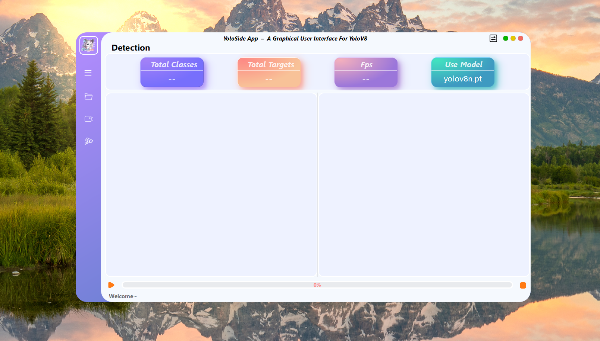

# YoloSide ~ A GUI For YoloV8 `V2.0`
---

## 🛑Warning
- This project has been discontinued for maintenance, and normal operation is not guaranteed. You can continue to refer to the following projects. Thanks to every open source contributor for their contribution.
- 此项目已经停止维护，不保证仍能正常运行。您可以继续参考以下项目：
- [Ultralytics-PySide6](https://github.com/WangQvQ/Ultralytics-PySide6)
- [YOLOSHOW](https://github.com/SwimmingLiu/YOLOSHOW)
- [yolov8客户端-简单修改](https://www.bilibili.com/video/BV1xh4y1F7sv/?spm_id_from=333.999.0.0&vd_source=0940bf29b38efba56ccfc6a3cef8182d)
- [YOLOv8-GUI-PySide6](https://github.com/SuPoTing/YOLOv8-GUI-PySide6)
- Please search for more projects on github yourself, all the best.

## How to Run
- `python>=3.8`
- `pip install ultralytics==8.0.48`
- `pip install pyside6==6.4.2`
- `python main.py`

#### !!The corresponding version of the library must be installed
#### !!Otherwise, the following error will appear:`not enough values to unpack (expected 5, got 4)`

## Notice
- `ultralytics` follows the `GPL-3.0`, if you need commercial use, you need to obtain its license.
- If you expect to use your own model, you need to use `ultralytics` to train the yolov8/5 model first, and then put the trained `.pt` file into the `models` folder.
- There are still some bugs in the software, and I will continue to optimize and add some more interesting functions as my time allows.
- If you check the save results, they will be saved in the `./run` path
- The UI design file is `home.ui`, if you modify it, you need to use the `pyside6-uic home.ui > ui/home.py` command to regenerate the `.py` file
- The resource file is `resources.qrc`, if you modify the default icon, you need to use the `pyside6-rcc resoures.qrc > ui/resources_rc.py` command to regenerate the `.py` file

## Video
- [BiliBili~YoloSide V2.0](https://www.bilibili.com/video/BV1Cb411f7cw/?spm_id_from=333.999.0.0)
- [Youtube~YoloSide V2.0](https://www.youtube.com/watch?v=auJLVrt7ImQ)

## To Do

- [ ] The input source supports camera and RTSP (if you need this function urgently, you can modify it according to the `chosen_cam`、`chose_rtsp`、`load_rtsp` function in `mian.py`)
- [ ] Graph showing changes in target quantity
- [ ] Target tracking
- [ ] Instance segmentation
- [ ] Monitor system hardware usage

## References
- [PyQt5-YOLOv5](https://github.com/Javacr/PyQt5-YOLOv5)
- [ultralytics](https://github.com/ultralytics/ultralytics)
- [pyqt5仿交易软件界面](https://www.bilibili.com/video/BV1tg411Y7KH/?spm_id_from=333.999.0.0&vd_source=0940bf29b38efba56ccfc6a3cef8182d)
